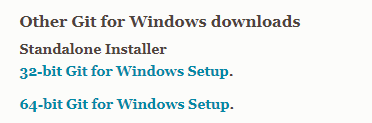
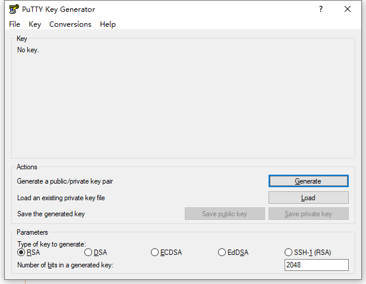

# StarBorder

#### 介绍
星球边境项目

#### 软件架构
软件架构说明
Unity-2022.2.1f1

#### 安装教程

1.  安装Git：[https://git-scm.com/download/win](http://https://git-scm.com/download/win)  
  
下载对已经的版本，现在应该都是64位。
正常安装，所有的选项都是用默认值就可以。

2.  安装TortoiseGit（小乌龟）[https://tortoisegit.org/download/](http://https://tortoisegit.org/download/)
也下载64位的就行，下面Language Packs还对应语言包，也可以找到中文下载一下，也下载64位的。
正常安装，有选项的话都是默认值就可以。安装好后会弹出选择语言，不用关掉面板，直接安装下好的语言包，之后点击Refresh按钮，就可以选择语言了。
安装完毕后有有对应的用户名和邮箱填写，填入github对应的名称和邮箱。  
  
安装和输入完毕后会弹出这个窗口。然后点击Generate按钮，等待生成Key。没有自动弹出窗口的话，在菜单栏里搜索PuTTYgen也可以打开
生成完毕后点击Save Public key和Save private key按钮保存一下文件。

3.  找到一个空文件夹（最好是英文路径）
鼠标右键弹出面板，找到Git Clone...选项，如果是中文版，找到Git 克隆...
弹出窗口
在URL一栏中输入：git@github.com:git1987/star-border.git
在下面加载Putty密钥中指定好之前保存的.ppk文件
然后确定，应该就可以下载工程了
